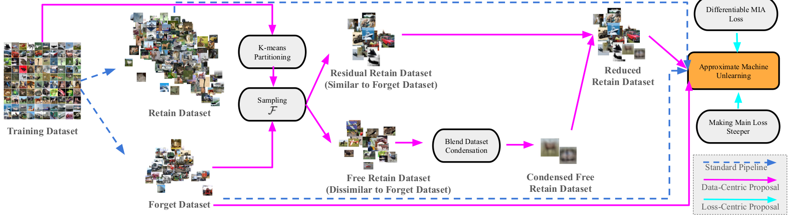

# Leveraging Distribution Matching to Make Approximate Machine Unlearning Faster





## Preliminary
### Install Dependencies
```code
git clone https://github.com/algebraicdianuj/DC_U.git && cd DC_U
conda create -n DCU python=3.8.19
conda activate DCU
pip install torch==2.0.0+cu118 torchvision==0.15.1+cu118 torchaudio==2.0.1+cu118 --index-url https://download.pytorch.org/whl/cu118
python -m pip install -U scikit-learn
conda install scikit-image
conda install -c conda-forge opacus
pip install timm
```


### Download Datasets and Get Pretrained Models
#### CIFAR-10
```code
./scripts/get_cifar10.sh
./scripts/run_train.sh
```

#### SVHN
```code
./scripts/get_svhn.sh
./scripts/run_train.sh
```

#### CINIC-10
```code
./scripts/get_cinic10.sh
./scripts/run_train.sh
```


## Experiment: Section 4.2
```code
./scripts/run_c_cifar10.sh
```


## Experiment: Section 4.3

### CIFAR-10
#### Without Condensation
```code
./scripts/run_u_cifar10.sh
```
#### With Condensation
```code
./scripts/run_cu_cifar10.sh
```
### SVHN
#### Without Condensation
```code
./scripts/run_u_svhn.sh
```

#### With Condensation
```code
./scripts/run_cu_svhn.sh
```


## Experiment: Section 4.4

### CINIC-10
Below are the different ablation configurations tested:

| ablative_ | Description |
|---------|-------------|
| v1.py | Condensing whole retain |
| v2.py | Residual retain dataset|
| v3.py | Condensing free images |
| v4.py | Free images |
| v5.py | Condensing residual images |
| v6.py | Residual images |
| v7.py | Retain images |

```code
./scripts/ablations.sh
```


## Experiment: Section 4.5
### CINIC-10
#### Without Condensation
```code
./scripts/multiround_unlearn.sh
```

#### With Condensation
```code
./scripts/multiround_cond_unlearn.sh
```


## SOTA Unlearning Implementation References Used in this Repo

- [Fischer Forgetting](https://github.com/AdityaGolatkar/SelectiveForgetting)

- [NTK Scrubbing](https://github.com/AdityaGolatkar/SelectiveForgetting)

- [Prunning and Sparsity driven Catastrophic Forgetting](https://github.com/OPTML-Group/Unlearn-Sparse)

- [Distillation based Unlearning](https://github.com/meghdadk/SCRUB)

- [Good and Bad Teacher Distillation based Unlearning](https://github.com/vikram2000b/bad-teaching-unlearning)


## SOTA Dataset Condensation References Used in this Repo
- [Dataset condensation with gradient matching](https://github.com/VICO-UoE/DatasetCondensation)
  
- [Dataset condensation with distribution matching](https://github.com/VICO-UoE/DatasetCondensation)
  
- [Improved distribution matching for dataset condensation](https://github.com/uitrbn/IDM)

